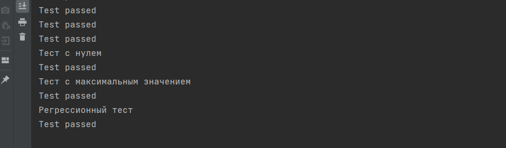

# Тестирование

Я написал четыре вида теста для функции сортировки массива. Первый тест я заполнил массивы случайными значениями и отсортировал их 
своим методом, и методом класса Arrays, и потом сравнил их. Второй тест я проверил пустой массив. Третий тест я заполнил массив максимальными значениями
и проверил. Четвертый тест у нас регрессионный тест. И после этого я написал эти же тесты используя junit.

### Вывод тестов без фреймворка

### Вывод тестов с Junit
